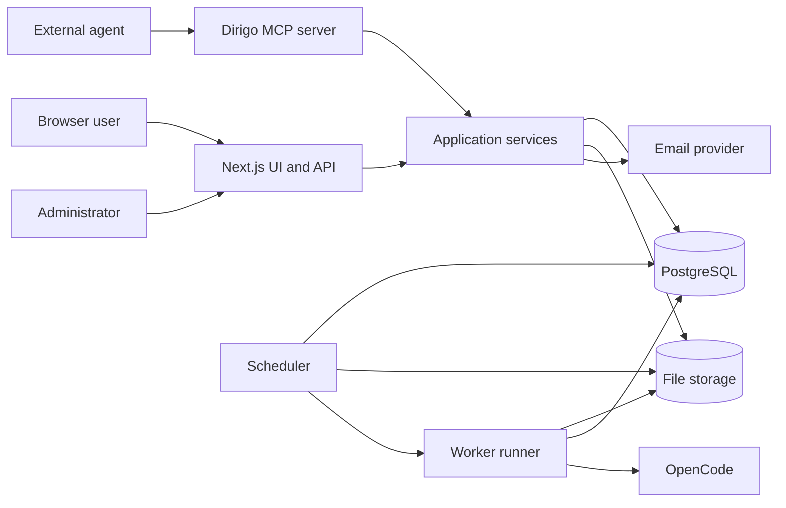
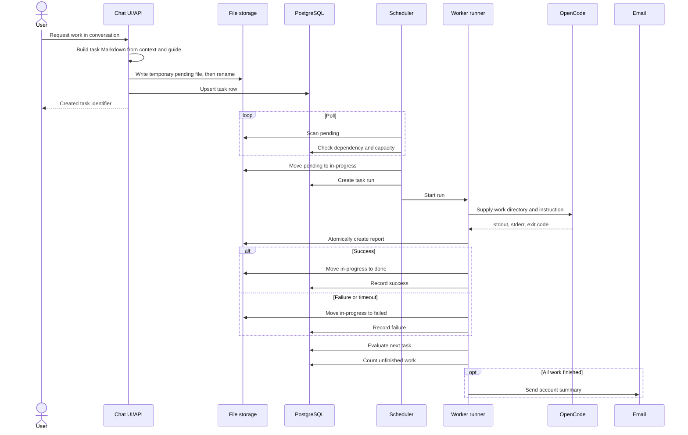
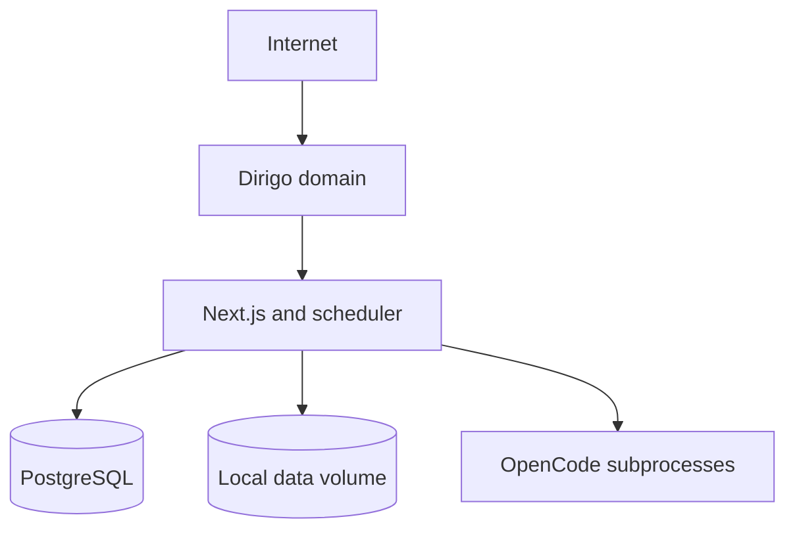
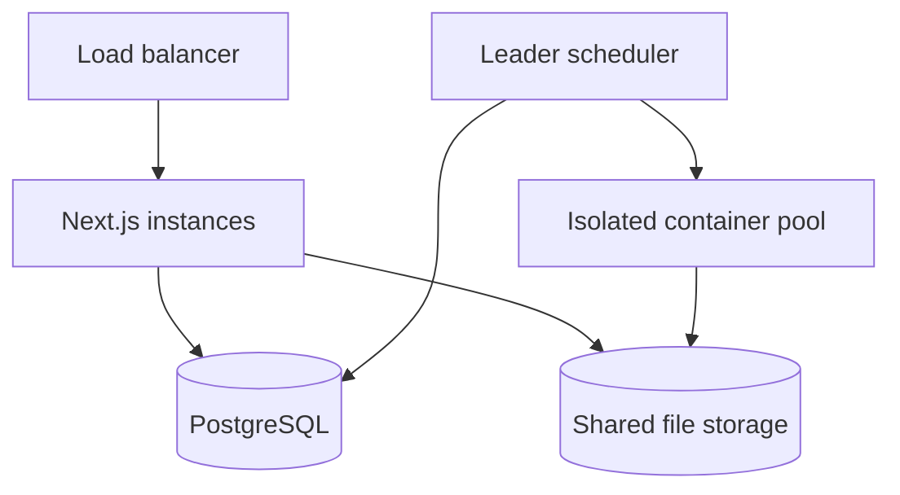
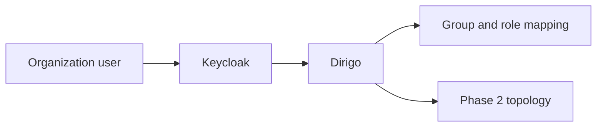

# Dirigo Architecture

> Naming history: The `dirigo.craftbay.io` domain was finalized and legacy APMS identifiers were retired on 2026-09-11. Database and container names remain unchanged for data safety.

## 1. Purpose and scope

*Implementation status: partial*

This document defines the logical and deployment architecture for Dirigo P1.
Phase 1 targets a single operator who is both administrator and user, Phase 2 targets isolated multi-user operation, and Phase 3 adds SSO.
Markdown files are the operational source of truth; PostgreSQL is the search, state, and aggregation index.

## 2. Design principles

*Implementation status: partial*

| Principle | Application |
|---|---|
| File first | Final task instructions and reports live in Markdown. |
| Atomic transitions | Queue state changes use directory `rename` on one filesystem. |
| Rebuildable | File scanning can rebuild the database index. |
| Least privilege | Web, scheduler, and workers receive only required paths and credentials. |
| User boundary | Every query and file access checks the authenticated user and project ownership. |
| Observable | Every run retains logs, timing, exit code, usage, and a report. |
| Progressive isolation | A runner interface allows the Phase 1 subprocess to become a Phase 2 container. |

File-first storage, ownership checks, run records, and a runner interface exist. Full credential isolation and the container runner remain planned.

## 3. Components

*Implementation status: partial*

| Component | Responsibility | Persistent state |
|---|---|---|
| Next.js web | UI, REST API, authentication, Markdown viewer | None |
| PostgreSQL | Users, projects, queue index, run and usage aggregates | Relational data |
| File storage | Guides, tasks, reports, and handover sources | `{user}/{project}/...` |
| Scheduler | Scan pending work, check dependencies, allocate slots | Scheduler state |
| Worker runner | Run an OpenCode subprocess and determine the result | Run logs and report |
| Email notification | Notify when a project workload finishes | Delivery result |
| Dirigo MCP server | Project, task, and document tools for external agents | None |

The web, database, storage, scheduler, runner, and email adapter are implemented. The MCP server is planned.

## 4. Logical structure

*Implementation status: partial*

The intended application-service layer lets web APIs and MCP share authorization and transactions.
MCP must return stable IDs rather than exposing file paths.
Long-running work belongs to the scheduler and worker, not request handlers.
The current implementation shares library functions but does not yet provide a distinct service layer or MCP server.

## 5. Request flow

*Implementation status: partial*

Files and database rows cannot share one ACID transaction, so reconciliation is the compensation mechanism.
If file creation succeeds but indexing fails, the reconciler can discover it later.
Task creation is implemented; durable idempotency keys and a batch-level completion model are planned.

## 6. Boundaries and interfaces

*Implementation status: partial*

| Boundary | Input | Output | Failure handling |
|---|---|---|---|
| UI to API | JSON, session cookie | JSON or Markdown | Standard error body |
| API to files | Validated relative path | Atomic write | Remove temporary file |
| API to database | UUID and metadata | Rows and aggregates | Transaction rollback |
| Scheduler to runner | Task and run IDs | Completion event | Recovery after failure |
| Runner to OpenCode | Instruction, cwd, environment | Logs and exit code | Terminate after timeout |
| Notification to email | Recipient and summary | Provider ID | Independent retry |

Most concrete boundaries exist. Formal leases, durable retries, and the shared MCP/service boundary are not complete.

## 7. Security

*Implementation status: partial*

Passwords use one-way hashes.
LLM API keys use application-layer encryption and must never appear in logs or responses.
Document/task paths and worker realpaths are confined to the data root or administrator allowlist.
Share links are read-only and expire after a configurable seven-day default.
Admin APIs require the `admin` role; users may access only owned resources.
The header omits the admin link entirely for non-admin users. The `/admin` Server Component and every `/api/admin/*` route handler call the shared `requireAdmin()` guard; rejected page access renders a 403 permission screen and rejected API access returns HTTP 403.
Workers receive a fresh allowlisted environment and isolated HOME/XDG directories, without server API keys or tokens.

Authentication uses a signed JWT with a 24-hour normal lifetime. When `POST /api/auth/login` receives `remember: true`, the JWT includes the `remember: true` claim and both JWT and session cookie use the configurable 30-day lifetime. The `dirigo_session` cookie always has matching `Max-Age` and `Expires` attributes, so closing and reopening the browser preserves the login until that deadline; expiry returns the user to the login screen. The cookie remains `HttpOnly`, `Secure`, and `SameSite=Lax`; there is no refresh token.

The login page's browser-only **Save ID/password** checkbox saves the email, Base64-obfuscated password, and automatic-login preference in `localStorage`, then restores them without automatically submitting. A successful unchecked login removes all three values. Base64 is not encryption, so the page warns against using this feature on a shared computer. The nested **Automatic login** checkbox is disabled until credential storage is selected; enabling automatic login selects storage, and clearing storage also clears automatic login. Only `remember` is sent to the authentication API. Logout deletes only the session cookie and leaves saved credentials intact. Authentication also retains the five-failure, 15-minute IP-plus-email lockout. Immutable unique user slugs, strict worker environment isolation, and configured-workdir confinement are implemented. The write-only secret store and #009 run-scoped LLM credential injection remain planned.

The shared header account label uses the database display name with an email fallback and links to authenticated `/settings`. Four settings cards separate immediate password submission from the dirty-tracked profile/preferences save bar. Unsaved browser and internal navigation is confirmed, saved layout defaults are mirrored to browser storage, and a display-name event updates AppShell without reload. The root metadata disables mobile telephone and email format detection. The completion notifier skips users who disabled email and resolves their configured recipient with account-email fallback.

## 8. Reliability and recovery

*Implementation status: partial*

| Situation | Recovery policy |
|---|---|
| Scheduler restart | The elected leader fails expired in-progress leases and creates diagnostic reports. |
| Worker crash | Close the run as failed and create a diagnostic report. |
| Database outage | Stop new mutations and reconcile partial file success later. |
| File outage | Stop pickup to avoid greater divergence. |
| Email outage | Keep work results and retry notification separately. |
| Duplicate event | Enforce uniqueness by task filename and run attempt. |

Leader-only startup recovery, 30-second heartbeats, 60-second leases, unique run attempts, and durable notification rows exist. Notification backoff and complete partial-failure repair remain incomplete.

## 9. Observability

*Implementation status: partial*

Structured logs should carry request, user, project, task, and run identifiers.
Sensitive prompts and credentials must be removed from log fields.
Primary metrics are queue depth, wait time, run duration, success rate, and slot utilization.
Notification failures, handovers, tokens, and cost also require aggregation.
Health should distinguish web, database, writable storage, and scheduler heartbeat.

Run records, usage aggregation, scheduler heartbeat, and health checks exist; full structured logging and metrics export are planned.

## 10. Deployment phase comparison

*Implementation status: planned*

| Item | Phase 1: single user | Phase 2: multi-user | Phase 3: SSO |
|---|---|---|---|
| Authentication | Local email/password | Local accounts and roles | Keycloak OIDC |
| Web | One instance | Horizontally scalable | OIDC callback added |
| Worker | Host subprocess | Per-task container | Container retained |
| Storage | Local persistent volume | Shared POSIX storage | Same |
| Isolation | Process permissions | Per-user containers and quotas | Organization/group mapping |
| Session | Signed cookie | Central database session | IdP token exchange |
| Operators | Admin is also user | Admins and users | Organization accounts |

### 10.1 Phase 1

The current deployment accepts a single-host failure domain; database and data volumes require regular backup.

### 10.2 Phase 2

Only one scheduler may dispatch work, selected by an advisory lock or leader lease.

### 10.3 Phase 3

Local password login can be disabled by policy while a separately managed emergency administrator remains available.

## 11. Extension points

*Implementation status: partial*

The Runner interface wraps subprocess and future container implementations in one input/result contract.
The Notification interface is intended to support channels beyond email.
An LLM connection encapsulates provider base URL, model, and encrypted credentials.
The planned MCP server should call the same service methods as REST to avoid duplicated rules.

Runner and LLM provider abstractions exist. Container, webhook/Telegram notification adapters, GitProvider, SecretProvider, and MCP remain planned.

## 12. Completion criteria

*Implementation status: partial*

- File and database state can be traced from request through report.
- Global concurrent execution never exceeds 20.
- A task whose prerequisite is unfinished does not run.
- Success and failure both retain a report and run record.
- Project completion sends one email notification.
- File sources can rebuild the task index.
- API and file formats remain stable across deployment phases.

The Phase 1 flow covers most criteria. Complete log retention, strict multi-instance concurrency, batch notifications, and cross-phase compatibility remain partial or planned.

## 13. Project chat workspace

*Implementation status: implemented*

`ChatPanel` is the shared chat UI for the standalone `/chat` page, the resizable project-side panel, and `/p/{slug}/chat` fullscreen mode. Project modes bind session listing and creation to the authenticated user's project slug. A project-scoped local-storage key preserves the active session through client-side fullscreen and panel navigation.

Explicit planning input follows a separate mutation branch. The server adds the current KST date and deterministic turn-intent hint to the planning-mode system rules; concrete planning calls `append_planning`, while content-free meta prompts and ordinary queries remain read-only. For mixed planning and explicit implementation requests, tool calls are ordered so the proposal append completes before the unchanged task-creation path. The append service holds a proposal-scoped lock, performs a content-hash conditional atomic rename with one conflict retry, reuses the date heading, merges normalized duplicates, and rejects credential patterns. The API—not a second LLM completion—builds the fixed confirmation response from the tool result, making `.proposal.md` the source of truth.

When a chat tool changes the proposal or task queue, the response carries the affected document keys and `ChatPanel` notifies the project workspace through both its callback and a project-scoped browser event. The currently open section reloads immediately; an active editor keeps its local content and shows a reload warning so the existing ETag conflict flow remains intact. Assistant messages also expose direct proposal/task links, including a return from fullscreen chat.

Desktop project pages use a 420 px side panel with a 6 px left-edge drag handle. Its width is clamped between 320 px and the smaller of 70% of the viewport or the viewport minus the 300 px project-content minimum, including when `apms.chat.panel.width` is restored; double-click restores 420 px. Fullscreen preference is kept in `apms.chat.panel.fullscreen`, and viewports at or below 900 px always use fullscreen mode. All three chat layouts contain intrinsic message width, wrap long text and links, and keep wide code blocks and tables on internal horizontal scrollers so the page never overflows horizontally.

Fullscreen project chat uses the same single-scroll-container structure as the panel: the viewport-height chat shell is fixed while only the message conversation scrolls, keeping the session header and composer stationary and sharing the same scroll-to-latest behavior.

On desktop, the project workspace is a viewport-height two-column container with page overflow disabled. Every bounded grid/flex ancestor in the task path (`project-workspace`, `project-layout`, `project-content`, and `tasks-view`) has `min-height: 0`. The project navigation, main content, and chat column therefore keep independent scroll boundaries, so opening a long task instruction, execution log, or report cannot change the chat panel's top position or height. The task list is one scroller with a sticky summary/new-task toolbar; its status sections use natural-height grid rows (`grid-auto-rows: max-content` and `align-content: start`) and do not clip their bodies, so every task row and pagination control remains reachable through that parent scroller. An open task uses a dedicated `flex: 1; min-height: 0; overflow: auto` child. At 768 px and below, these constraints are removed for the existing vertically stacked, page-scrolling layout. Document tabs continue to use the existing editor sizing and the main content scroller.

The shared header session picker lists the current project's sessions—or only projectless sessions on `/chat`—by latest message time. It supports creation, inline rename, deletion, and resuming a selected session. Handed-over sessions carry an ended badge, render read-only, and link to their continuation.

After the first assistant response is stored for a session whose title is empty or still a default (`New chat`/the legacy Korean defaults), the chat API makes one short, five-second-bounded completion through the default LLM connection. The prompt asks for a distinctive noun-phrase title rather than a copy of the request opening. Input is limited to 2,000 characters; output is sanitized and limited to 30 characters plus an ellipsis. A timeout, provider failure, or empty result falls back to the first line of the user's message, and title generation never fails the main chat response. The conditional database update rechecks the default title so a concurrent user rename is preserved. The title completion is not inserted into `messages`. The SSE response includes `session: { id, title }`, allowing `ChatPanel` to patch only the active session and matching picker item without refetching the full list.

The header stays fixed while only the message list scrolls. Its title and action controls occupy separate flex regions: the title may shrink to zero intrinsic width, defaults to a one-line ellipsis with the full value exposed through `title`, and expands to at most three clamped lines when the header is hovered or the title picker is focused. The non-shrinking, elevated action region keeps every control at least 32×32 px and clickable without overlapping the title, including 280 px split panels and 375 px mobile viewports. The header's variable height is absorbed by the existing `min-height: 0` grid chain, leaving the independently scrolling message list and composer reachable. New content follows automatically only within 80 px of the bottom; otherwise a latest-message control with an unread badge appears. User and completed assistant cards copy their stored raw Markdown `content`, with a legacy clipboard fallback.

The composer remains editable while an assistant response is pending, preserving focus and cursor position. During that period only submission is locked: the send button is disabled, plain Enter does not submit (and remains available for a newline), and an `aria-live` status explains that sending resumes after generation. Each session's independent draft is stored under `apms.chat.draft.<sessionId>` in `sessionStorage` after a 300 ms debounce and restored on session changes or reloads. The submitted draft is cleared, while text typed during generation survives response completion, errors, session-list refreshes, resizing, and fullscreen transitions. Completion only returns focus to an empty composer; errors keep the submitted user card and never restore its text over a newer draft.

## 14. Shared Markdown editor

*Implementation status: implemented*

All Markdown editing surfaces—including project guides, handovers, settings, future shared guidance, and drafts—must reuse `MdEditor`. It dynamically loads the client-only `WysiwygEditor` (`ssr: false`), owns save, dirty-state departure protection, and conflict choices, and offers raw Markdown only through the **MD source** toggle. Hosts provide the project slug, document-relative path, loading, and an `If-Match` save callback. Feature-specific textarea editors are not permitted.

The WYSIWYG document uses `StarterKit`, link, image, resizable table/row/header/cell, task list/item, syntax-aware code block, placeholder, bubble menu, and `tiptap-markdown`. Relative image sources are rewritten only for display to the authenticated `GET /api/projects/{slug}/files?path=` endpoint and restored before save. That endpoint checks project ownership, rejects traversal and symlink escape, and permits image files only under project `docs/` or `tasks/`.

| Toolbar and slash commands | Available actions |
|---|---|
| Toolbar | H1–H3, bold, italic, strike, inline code, link, image, bullet/ordered/task list, language-tagged code block, blockquote, horizontal rule, row/column-sized table |
| Slash (`/`, filtered) | H1–H3, bullet/ordered/task list, code block, table, blockquote, horizontal rule |
| Table context menu | Add/delete row or column, toggle header, merge/split cells, delete table |
| Selection bubble menu | Bold, italic, inline code, link, strike |

| Keyboard input | Result |
|---|---|
| `Ctrl/Cmd+S` | Save changed Markdown |
| `Tab` / `Shift+Tab` in a list | Indent / outdent list or task item |
| Slash menu `Up` / `Down` / `Enter` / `Escape` | Select / run / close |
| `<-> `, `-> `, `<- `, `=> `, `<= ` | `↔ `, `→ `, `← `, `⇒ `, `⇐ ` outside code blocks and inline code |

## 15. Project task workspace

*Implementation status: implemented*

The project task view presents the in-progress, pending, done, failed, and report queues as collapsible sections with summary badges. Task creation is initiated by the **New task** control beside those badges instead of an always-visible form in the pending section.

## 17. Configuration hierarchy

*Implementation status: implemented*

The configuration core is shared by consumers, API routes, and the CLI. It validates strict Zod schemas, merges defaults → global YAML → project YAML → environment while retaining a source per leaf, resolves `${env:NAME}` references after validation, and masks secret-shaped fields at the API boundary. Project files are limited to project-scoped sections.

Writes validate first, compare a SHA-256 precondition, fsync a same-directory temporary file, rename it, and append an audit line. The loader is stateless so server requests see disk immediately; the scheduler reloads YAML during its recurring settings tick. UI editing is intentionally outside this phase.

The creation dialog preserves title, Markdown instruction body, prerequisite, follow-up, and timeout fields. It validates timeout as an integer from 1 to 1440 minutes, retains input and displays an inline API error after a failed request, and refreshes the pending queue and summary after success. Escape, backdrop, and close controls dismiss it; non-empty edits require confirmation. Opening focuses the title and locks page scrolling. At viewport widths of 900 px or less, the dialog becomes a full-screen sheet.
# LLM health and chat chronology

Implementation status: Implemented (#017).

The PostgreSQL-advisory-lock scheduler leader probes enabled global LLM connections every 60 seconds and stores `last_check_at`, `last_ok`, and the bounded upstream error text. The authenticated status endpoint may refresh stale data, while chat performs the same probe at send time so a request cannot fail behind a stale green indicator. Health failures are deliberately visible above every chat composer; administrators receive a management link and other users receive an escalation instruction.

Message cards use their database `created_at` values and a shared KST formatter. It emits `HH:mm` for the current KST calendar day and `M/D HH:mm` otherwise, while the DOM retains the complete ISO timestamp. Continued sessions render a numbered, timestamped handover divider before their first message.
## LLM health monitoring and chat visibility

*Implementation status: implemented*

The elected task-scheduler leader checks enabled global LLM connections every 60 seconds. Compatible and OpenAI providers use `GET {normalized_base_url}/v1/models`; provider-specific authentication headers are applied, with a five-second timeout. Results are persisted on `llm_connections` as `last_check_at`, `last_ok`, and `last_error`, including a stable failure classification.

The chat client polls the authenticated status endpoint on the same cadence and keeps a non-success banner directly above the composer. Administrators receive a management link, while other users receive an administrator-contact action. Message and session timestamps share one KST formatter, and continued sessions start with a handover divider so reconnects preserve chronology.

## 16. Project chat web-tool pipeline

*Implementation status: implemented*

The chat route advertises `fetch_url` on every request and adds `web_search` only when the server has `DIRIGO_SEARXNG_URL`. URL intent and search intent are reinforced in the system prompt. Each LLM round may request tools; web reads/searches run before planning capture, `append_planning` remains ahead of `create_task`, and the loop stops after three tool rounds. Tool outputs are inserted as explicitly untrusted system context for the next round. The server also enforces source blocks and stable failure wording so they cannot disappear from the final response.

`fetch_url` resolves and rejects non-public destinations before the request and after every manual redirect, bounds redirects/time/bytes, and accepts HTML only. `web_search` selects Korean or English from the query, clamps results to five, and applies an in-process session/minute limiter. Result URLs flow into the final answer and, for combined planning or task requests, into proposal entries and task bodies. Existing `messages.metadata` records the tool name, target, success/error status, and elapsed milliseconds.
