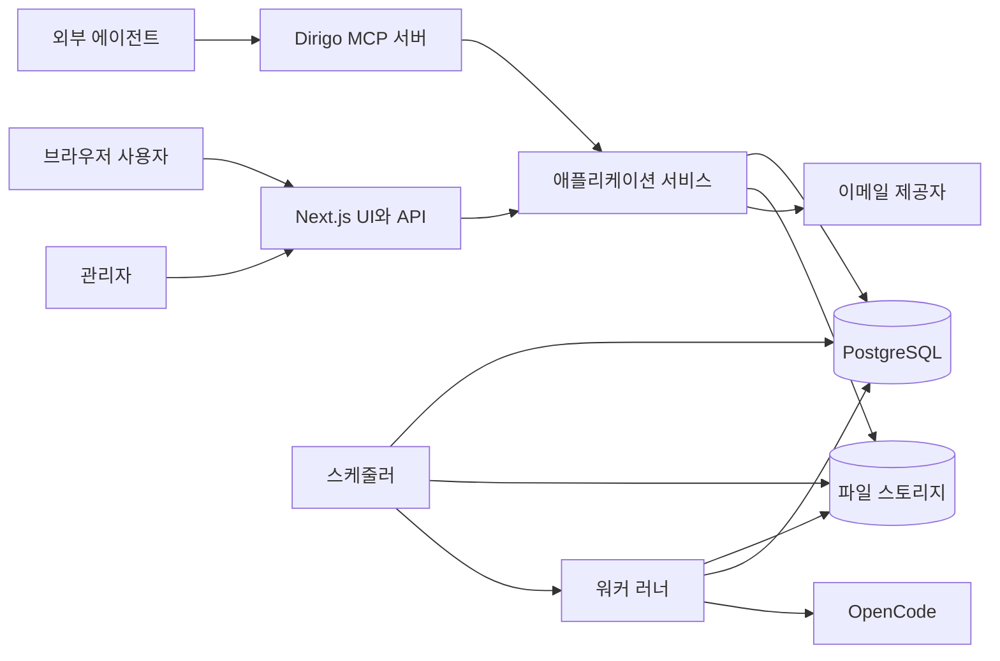
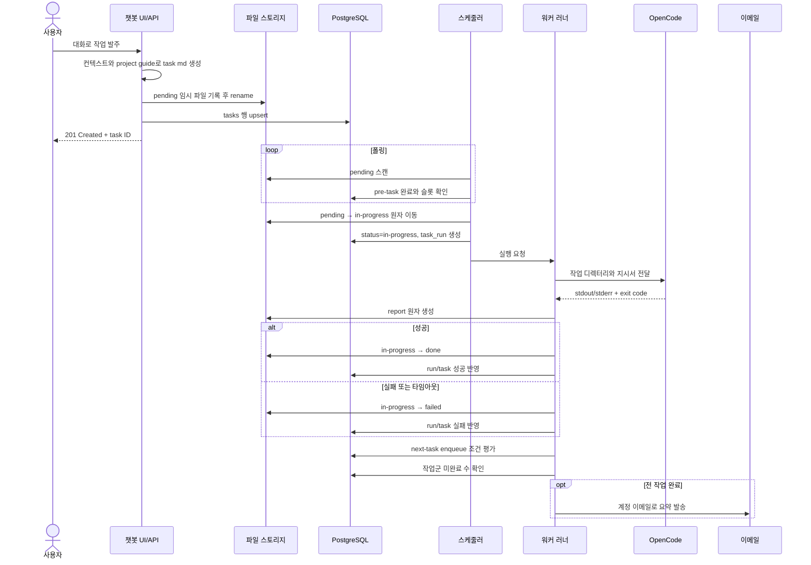
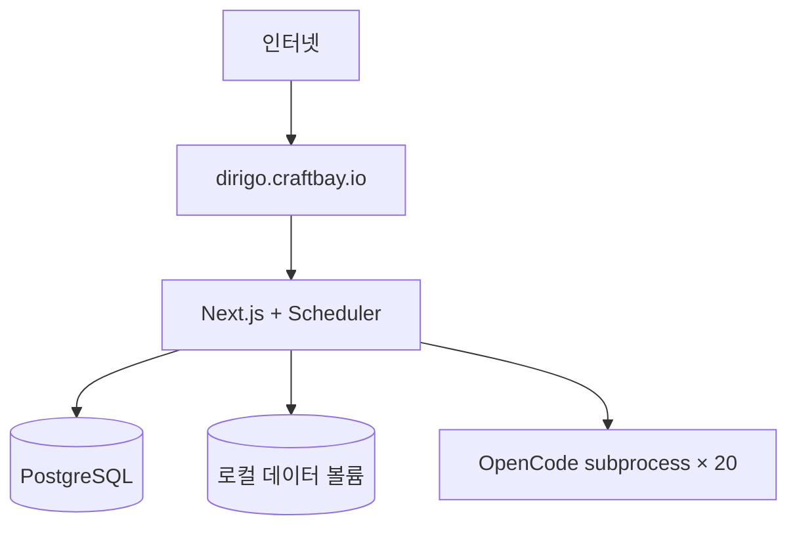
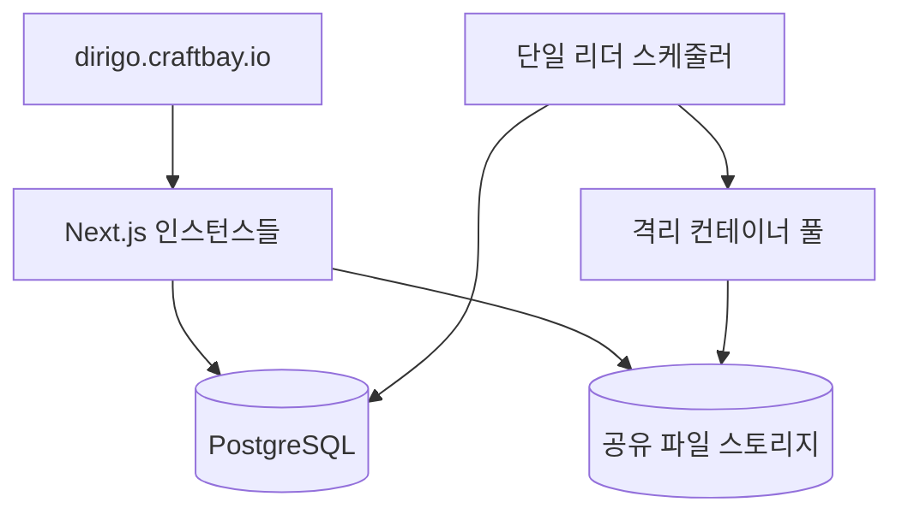
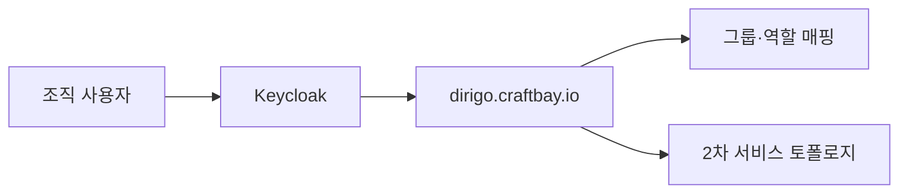

# Dirigo 아키텍처

> 명칭 변경 이력: 2026-09-11 도메인을 `dirigo.craftbay.io`로 확정하고 구 APMS 식별자를 폐기했습니다. 데이터 안전을 위해 DB·컨테이너명은 유지합니다.

## 1. 목적과 범위

*Implementation status: partial*

이 문서는 Dirigo P1의 논리·배포 아키텍처와 주요 요청 흐름을 정의한다.
1차는 관리자 겸 사용자 1인 운영, 2차는 격리된 다중 사용자, 3차는 SSO 연동을 목표로 한다.
Markdown 파일을 업무 원본으로, PostgreSQL을 검색·상태·집계 인덱스로 사용한다.

## 2. 설계 원칙

*Implementation status: partial*

| 원칙 | 적용 |
|---|---|
| 파일 우선 | 작업지시서와 보고서의 최종 내용은 Markdown이 진실이다. |
| 원자적 상태 전이 | 같은 파일시스템 안의 디렉터리 `rename`으로 큐 상태를 바꾼다. |
| 재구축 가능 | DB 인덱스는 파일 스캔으로 복구할 수 있다. |
| 최소 권한 | 웹, 스케줄러, 워커는 필요한 경로와 자격 증명만 받는다. |
| 사용자 경계 | 모든 조회와 파일 접근은 인증 사용자 및 프로젝트 소유권을 검사한다. |
| 관측 가능성 | 실행마다 로그, 시간, 종료 코드, 사용량과 보고서를 남긴다. |
| 단계적 격리 | 1차 subprocess를 2차 컨테이너 러너로 교체 가능하게 추상화한다. |

## 3. 구성요소

*Implementation status: partial*

| 구성요소 | 책임 | 영속 상태 |
|---|---|---|
| Next.js 웹 | UI, REST API, 인증, Markdown 뷰어 | 없음 |
| PostgreSQL | 사용자, 프로젝트, 큐 인덱스, 실행·사용량 집계 | 관계형 데이터 |
| 파일 스토리지 | 지침, 작업, 보고서, 핸드오버 원본 | `{user}/{project}/...` |
| 스케줄러 | pending 스캔, 의존성 확인, 슬롯 배정 | DB lease |
| 워커 러너 | OpenCode subprocess 실행과 결과 판정 | 실행 로그 |
| 메일 알림 | 프로젝트 작업군 완료 통지 | 전송 결과 |
| Dirigo MCP 서버 | 에이전트용 프로젝트·작업·문서 도구 | 없음 |

## 4. 논리 구조

*Implementation status: partial*

애플리케이션 서비스 계층은 웹 API와 MCP가 동일한 권한 검사와 트랜잭션을 재사용하게 한다.
MCP는 파일 경로를 직접 노출하지 않고 안정적인 사용자·프로젝트·작업 ID를 반환한다.
웹 프로세스는 장시간 실행을 수행하지 않으며 스케줄러에 큐 상태만 제공한다.

## 5. 요청 흐름

*Implementation status: partial*

파일 생성과 DB insert는 단일 ACID 트랜잭션이 아니므로 보상 절차를 둔다.
파일 기록 성공 뒤 DB 기록이 실패하면 재색인기가 파일을 발견해 행을 생성한다.
DB 기록 뒤 응답이 끊겨도 idempotency key로 중복 발주를 방지한다.

## 6. 경계와 인터페이스

*Implementation status: partial*

| 경계 | 입력 | 출력 | 실패 처리 |
|---|---|---|---|
| UI → API | JSON, 세션 쿠키 | JSON/Markdown | 표준 오류 본문 |
| API → 파일 | 검증된 상대 경로 | 원자 기록 | 임시 파일 제거 |
| API → DB | UUID와 메타데이터 | 행/집계 | 트랜잭션 rollback |
| 스케줄러 → 러너 | task/run ID | 완료 이벤트 | lease 만료 후 복구 |
| 러너 → OpenCode | 지시서, cwd, 환경 | 로그, 종료 코드 | timeout 후 종료 |
| 알림 → 이메일 | 수신자, 요약 | provider ID | 지수 backoff 재시도 |

## 7. 보안

*Implementation status: partial*

비밀번호는 단방향 해시로 저장한다.
LLM API Key는 서버 관리 키로 암호화하고 평문을 로그나 응답에 포함하지 않는다.
문서·작업 경로와 워커 실제 경로는 데이터 루트 또는 관리자 allowlist 내부로 제한한다.
공유 링크는 기본 7일의 설정 가능한 만료 시간과 난수 토큰을 가지며 읽기 전용이다.
관리 API는 `admin` 역할을 요구하고 일반 사용자는 자기 리소스만 접근한다.
헤더의 관리자 링크는 일반 사용자 DOM에 아예 렌더하지 않는다. `/admin` 서버 컴포넌트와 모든 `/api/admin/*` route handler는 공용 `requireAdmin()` 가드를 호출하며, 거부된 페이지 접근은 403 권한 화면을 렌더하고 API 접근은 HTTP 403을 반환한다.
워커는 서버 API 키와 토큰 없이 새 allowlist 환경과 격리된 HOME/XDG 디렉터리를 받는다.

인증은 일반 로그인에서 24시간 서명 JWT를 사용한다. `POST /api/auth/login`이 `remember: true`를 받으면 JWT에 `remember: true` 클레임을 넣고 JWT와 세션 쿠키 모두 설정 가능한 30일 수명을 사용한다. `dirigo_session` 쿠키에는 항상 같은 기간의 `Max-Age`와 `Expires`를 부여하므로 브라우저를 닫았다 열어도 만료 시각까지 로그인이 유지되고, 만료 후에는 로그인 화면으로 이동한다. 쿠키의 `HttpOnly`, `Secure`, `SameSite=Lax` 속성은 유지하며 refresh token은 없다.

로그인 화면의 브라우저 전용 **ID/PW 저장** 체크박스는 이메일, Base64로 난독화한 비밀번호, 자동 로그인 선택 상태를 `localStorage`에 저장하고 자동 제출 없이 복원한다. 체크하지 않은 로그인에 성공하면 세 값을 모두 삭제한다. Base64는 암호화가 아니므로 화면에서 공용 PC 사용을 경고한다. 아래에 들여쓴 **자동 로그인**은 ID/PW 저장 전에는 비활성화되며, 자동 로그인 선택 시 ID/PW 저장도 선택되고 ID/PW 저장 해제 시 자동 로그인도 해제된다. 인증 API에는 `remember`만 전송한다. 로그아웃은 세션 쿠키만 삭제하고 저장된 자격 증명은 유지한다. IP+이메일 기준 15분 동안 5회 실패 잠금도 그대로 적용한다. 불변 unique 사용자 slug, 워커 환경 격리, 설정 workdir 제한은 구현되었고 write-only 시크릿 저장소와 #009 실행별 LLM 자격 주입은 계획 상태다.

공용 헤더 계정명은 DB 표시 이름을 우선 사용하고 없으면 이메일을 표시하며 로그인 필수 `/settings`로 연결한다. 네 설정 카드는 즉시 처리하는 비밀번호 변경과 dirty 추적 대상인 프로필·환경설정 저장 바를 분리한다. 미저장 브라우저·내부 이동을 확인하고, 저장된 레이아웃 기본값을 브라우저 저장소에 반영하며, 표시 이름 이벤트로 AppShell을 새로고침 없이 갱신한다. 루트 metadata는 모바일 전화번호·이메일 감지를 차단한다. 완료 알림은 이메일을 끈 사용자를 건너뛰고 설정 수신자를 계정 이메일 fallback과 함께 사용한다.

## 8. 신뢰성과 복구

*Implementation status: partial*

| 상황 | 복구 정책 |
|---|---|
| 스케줄러 재시작 | 선출된 리더가 만료된 in-progress lease를 failed 처리하고 진단 보고서를 만든다. |

30초 heartbeat, 60초 lease와 리더 전용 복구가 구현되었다.
| 워커 비정상 종료 | 실행을 failed로 닫고 진단 보고서를 생성한다. |
| DB 장애 | 신규 변경을 중단하고 파일만 쓰는 부분 성공을 재색인한다. |
| 파일 장애 | 큐 픽업을 중단해 DB와 원본의 추가 불일치를 막는다. |
| 이메일 장애 | 작업 결과는 유지하고 알림만 별도 재시도한다. |
| 중복 이벤트 | task ID와 run attempt의 유일 제약으로 멱등 처리한다. |

## 9. 관측성

*Implementation status: partial*

구조화 로그에는 request_id, user_id, project_id, task_id, run_id를 기록한다.
민감한 프롬프트와 키 값은 로그 필드에서 제거한다.
핵심 지표는 큐 깊이, 대기 시간, 실행 시간, 성공률, 슬롯 사용률이다.
알림 실패율, 세션 핸드오버 수, 토큰과 비용도 집계한다.
health는 웹, DB, 파일 쓰기 가능 여부, 스케줄러 heartbeat를 구분한다.

## 10. 배포 단계 비교

*Implementation status: planned*

| 항목 | 1차 단독 사용 | 2차 다중 사용자 | 3차 SSO |
|---|---|---|---|
| 인증 | 자체 이메일/비밀번호 | 자체 계정과 역할 | Keycloak OIDC |
| 웹 | 단일 인스턴스 가능 | 수평 확장 가능 | OIDC callback 추가 |
| 워커 | 호스트 subprocess | 작업별 컨테이너 | 컨테이너 유지 |
| 스토리지 | 로컬 영속 볼륨 | 공유 POSIX 스토리지 | 동일 |
| 격리 | 프로세스 권한 | 사용자별 컨테이너·쿼터 | 조직·그룹 매핑 |
| 세션 | 서명 쿠키 | 중앙 DB 세션 | IdP 토큰 교환 |
| 운영 대상 | 관리자 겸 사용자 | 관리자와 일반 사용자 | 조직 계정 |

### 10.1 1차

단일 호스트 장애 영역을 수용하되 DB와 데이터 볼륨은 정기 백업한다.

### 10.2 2차

스케줄러는 advisory lock 또는 leader lease로 한 인스턴스만 배정한다.

### 10.3 3차

로컬 비밀번호 로그인은 운영 정책에 따라 비활성화하고 비상 관리자만 별도 관리한다.

## 11. 확장 지점

*Implementation status: partial*

Runner 인터페이스는 subprocess와 container 구현을 동일한 입력·결과 타입으로 감싼다.
Notification 인터페이스는 이메일 외 채널을 추가할 수 있게 한다.
LLM connection은 공급자별 base URL, 모델, 암호화 자격 증명을 캡슐화한다.
MCP 서버는 REST와 동일한 서비스 메서드를 호출해 규칙 중복을 피한다.

## 12. 완료 기준

*Implementation status: partial*

- 발주부터 보고서까지 파일과 DB 상태를 추적할 수 있다.
- 동시 실행은 전역 20개를 넘지 않는다.
- 선행 작업이 끝나지 않은 작업은 실행되지 않는다.
- 성공·실패 모두 보고서와 실행 로그를 남긴다.
- 프로젝트 작업군 종료 시 이메일을 한 번만 발송한다.
- DB 인덱스를 파일 원본으로 재구축할 수 있다.
- 단계별 배포에서 API와 파일 규격이 유지된다.

## 13. 프로젝트 챗 워크스페이스

*Implementation status: implemented*

`ChatPanel`은 단독 `/chat` 페이지, 크기 조절 가능한 프로젝트 우측 패널, `/p/{slug}/chat` 전체화면 모드가 공유하는 채팅 UI다. 프로젝트 모드는 인증 사용자가 소유한 프로젝트 slug로 세션 조회와 생성을 고정한다. 프로젝트별 localStorage 키가 패널과 전체화면의 클라이언트 라우팅 중 활성 세션을 유지한다.

명시적인 기획 입력은 별도 변경 분기를 따릅니다. 서버는 기획 모드 시스템 규칙에 현재 KST 날짜와 결정론적 턴 의도 힌트를 추가합니다. 구체 기획은 `append_planning`을 호출하고, 내용 없는 메타 발화와 일반 질의는 읽기 전용으로 남습니다. 기획과 명시적 구현 요청이 섞이면 proposal append가 기존 작업 생성 경로보다 먼저 끝나도록 도구 호출 순서를 보장합니다. append 서비스는 proposal 전용 잠금을 잡고 content hash 조건부 원자적 rename과 1회 충돌 재시도를 수행하며, 날짜 절 재사용·정규화 중복 병합·자격 증명 패턴 거부를 담당합니다. 별도 LLM 후속 응답이 아니라 API가 도구 결과에서 고정 확인 문구를 생성하므로 `.proposal.md`가 단일 진실 원천입니다.

챗 도구가 기획서나 작업 큐를 바꾸면 응답에 변경된 문서 키를 담고 `ChatPanel`이 callback과 프로젝트 범위 브라우저 이벤트를 모두 보내 프로젝트 워크스페이스에 알립니다. 현재 열린 절은 즉시 다시 불러오되 편집 중이면 로컬 내용을 유지하고 다시 불러오기 경고를 표시하여 기존 ETag 충돌 흐름을 보존합니다. assistant 메시지에는 전체화면 채팅에서 패널로 돌아오는 동작을 포함한 기획서·작업 바로가기 링크도 표시합니다.

데스크톱 프로젝트 화면은 왼쪽 경계에 6px 드래그 핸들이 있는 기본 420px 패널을 사용한다. 폭은 320px 이상이면서 화면 70%와 화면에서 프로젝트 콘텐츠 최소 300px을 뺀 값 중 작은 상한으로 제한되고, `apms.chat.panel.width` 복원 시에도 같은 제한을 적용하며, 더블클릭하면 420px로 복원된다. 전체화면 선호는 `apms.chat.panel.fullscreen`에 저장하고 화면 폭이 900px 이하이면 항상 전체화면을 사용한다. 세 채팅 레이아웃 모두 메시지의 intrinsic width를 억제하고 긴 텍스트와 링크를 줄바꿈하며, 넓은 코드 블록과 표는 내부 가로 스크롤만 사용해 페이지 가로 overflow를 방지한다.

데스크톱 프로젝트 워크스페이스는 페이지 overflow를 막은 뷰포트 높이의 2열 컨테이너다. 작업 경로의 높이가 제한된 모든 grid/flex 조상(`project-workspace`, `project-layout`, `project-content`, `tasks-view`)에 `min-height: 0`을 둔다. 따라서 프로젝트 내비게이션, 주 콘텐츠, 채팅 열은 서로 독립된 스크롤 경계를 가지며 긴 작업지시서·실행 로그·리포트를 열어도 채팅 패널의 상단 위치와 높이가 바뀌지 않는다. 작업 목록은 요약·새 작업 툴바가 sticky인 하나의 스크롤 컨테이너다. 상태 섹션은 자연 높이 grid 행(`grid-auto-rows: max-content`, `align-content: start`)을 사용하고 본문을 자르지 않아 모든 작업 행과 페이지네이션을 부모 스크롤로 접근할 수 있다. 열린 작업은 `flex: 1; min-height: 0; overflow: auto`인 전용 자식에서 내부 스크롤한다. 768px 이하에서는 기존 세로 스택과 페이지 스크롤을 위해 이 제약을 해제한다. 문서 탭은 기존 편집기 높이 계산과 주 콘텐츠 스크롤을 그대로 사용한다.

공용 상단 세션 드롭다운은 프로젝트 화면에서 현재 프로젝트 세션을, `/chat`에서는 프로젝트 없는 세션만 마지막 메시지 최신순으로 표시한다. 새 채팅, 인라인 이름 변경, 삭제, 세션 재개를 지원한다. 핸드오버된 세션에는 종료 배지를 표시하고 읽기 전용으로 열며 후속 세션 링크를 제공한다.

제목이 비어 있거나 기본값(`새 채팅` 또는 기존 `새 대화`)인 세션에서 첫 assistant 응답을 저장한 직후, 채팅 API는 기본 LLM 연결로 5초 제한의 짧은 completion을 한 번 실행한다. 프롬프트는 요청 앞부분을 복사하지 않은 구분 가능한 명사구 제목을 요구한다. 입력은 2,000자로 제한하고 출력은 정리 후 최대 30자와 말줄임표로 제한한다. 타임아웃·LLM 실패·빈 결과이면 사용자 메시지 첫 줄을 폴백으로 사용하며 제목 생성 실패가 본 채팅 응답을 실패시키지 않는다. 조건부 DB 갱신에서도 제목이 기본값인지 다시 확인하므로 동시에 사용자가 바꾼 이름은 보존한다. 제목 completion은 `messages`에 저장하지 않는다. SSE 응답의 `session: { id, title }`로 `ChatPanel`은 전체 목록을 다시 조회하지 않고 활성 세션과 드롭다운의 해당 항목만 갱신한다.

상단 헤더는 고정하고 메시지 목록만 스크롤한다. 제목과 액션은 별도 flex 영역을 사용한다. 제목 영역은 intrinsic width를 0까지 줄일 수 있고 기본 한 줄 말줄임과 전체 값을 담은 `title`을 제공하며, 헤더 hover 또는 제목 선택기 focus 시 최대 3줄 clamp로 펼쳐진다. 줄어들지 않고 상위 z-index를 갖는 액션 영역은 각 버튼을 최소 32×32px로 유지해 280px 분할 패널과 375px 모바일에서도 제목과 겹치지 않고 클릭할 수 있다. 가변 헤더 높이는 기존 `min-height: 0` grid 체인에서 흡수되어 메시지 독립 스크롤과 입력창 접근성을 유지한다. 하단 80px 이내일 때만 새 내용을 자동으로 따라가며, 그 밖에서는 미확인 배지가 있는 최신 메시지 이동 버튼을 표시한다. 사용자 메시지와 완료된 assistant 메시지는 저장된 Markdown 원문 `content`를 복사하며 구형 클립보드 폴백을 제공한다.

assistant 응답 생성 중에도 입력창은 편집 가능하며 포커스와 커서 위치를 유지한다. 이때 전송만 잠근다. 전송 버튼을 비활성화하고 일반 Enter는 전송하지 않는 대신 줄바꿈으로 사용할 수 있으며, `aria-live` 상태 문구로 생성 완료 후 전송할 수 있음을 안내한다. 세션별 독립 draft는 300ms debounce 후 `sessionStorage`의 `apms.chat.draft.<sessionId>`에 저장하고 세션 전환이나 새로고침 때 복원한다. 전송한 draft는 비우지만 생성 중 새로 입력한 내용은 응답 완료·오류·세션 목록 갱신·패널 크기 변경·전체화면 전환에도 유지한다. 완료 시 입력창이 비어 있을 때만 포커스를 되돌리며, 오류가 나도 전송한 사용자 카드는 유지하고 그 본문으로 새 draft를 덮어쓰지 않는다.

## 14. 공용 Markdown 편집기

*Implementation status: implemented*

프로젝트 지침·핸드오버·설정뿐 아니라 이후의 공통 지침과 drafts 등 모든 Markdown 편집 화면은 `MdEditor`를 재사용한다. 이 컴포넌트는 클라이언트 전용 `WysiwygEditor`를 동적 로드(`ssr: false`)하고 저장, 변경 상태 이탈 방지, 충돌 선택을 담당하며 원문은 **MD 원문** 토글로만 제공한다. 각 화면은 프로젝트 slug, 문서 상대 경로, 로드 함수와 `If-Match` 저장 콜백을 제공한다. 기능별 textarea 편집기를 별도로 만들지 않는다.

WYSIWYG 문서는 `StarterKit`, 링크, 이미지, 크기 조절 표/행/헤더/셀, 체크리스트/항목, 언어 인식 코드 블록, placeholder, bubble menu, `tiptap-markdown`을 사용한다. 상대 이미지 경로는 표시할 때만 인증된 `GET /api/projects/{slug}/files?path=` 주소로 바꾸고 저장 전에 원래 상대 경로로 복원한다. 이 API는 프로젝트 소유권을 확인하고 경로 탈출과 심볼릭 링크 탈출을 거부하며 프로젝트 `docs/` 또는 `tasks/` 아래 이미지 파일만 제공한다.

| 툴바와 slash 명령 | 제공 기능 |
|---|---|
| 툴바 | H1–H3, 굵게, 기울임, 취소선, 인라인 코드, 링크, 이미지, 불릿/번호/체크 목록, 언어 지정 코드 블록, 인용, 수평선, 행·열 크기 지정 표 |
| Slash (`/`, 필터 지원) | H1–H3, 불릿/번호/체크 목록, 코드 블록, 표, 인용, 수평선 |
| 표 컨텍스트 메뉴 | 행·열 추가/삭제, 헤더 토글, 셀 병합/분할, 표 삭제 |
| 선택 영역 bubble menu | 굵게, 기울임, 인라인 코드, 링크, 취소선 |

| 키보드 입력 | 결과 |
|---|---|
| `Ctrl/Cmd+S` | 변경된 Markdown 저장 |
| 목록 안 `Tab` / `Shift+Tab` | 목록·체크 항목 들여쓰기 / 내어쓰기 |
| Slash 메뉴 `위` / `아래` / `Enter` / `Escape` | 선택 / 실행 / 닫기 |
| `<-> `, `-> `, `<- `, `=> `, `<= ` | 코드 블록·인라인 코드 밖에서 `↔ `, `→ `, `← `, `⇒ `, `⇐ ` |

## 15. 프로젝트 작업 워크스페이스

*Implementation status: implemented*

프로젝트 작업 화면은 진행, 대기, 완료, 실패, 리포트 큐를 요약 배지와 접이식 섹션으로 표시한다. 작업 생성은 대기 섹션에 상시 노출하던 폼 대신 요약 배지 옆 **새 작업** 버튼에서 시작한다.

## 17. 설정 계층

*구현 상태: 구현 완료*

설정 코어는 기존 소비처, API route, CLI가 함께 사용합니다. 엄격한 Zod 스키마를 검증하고 코드 기본값 → 전역 YAML → 프로젝트 YAML → 환경변수 순으로 병합하면서 leaf별 출처를 유지합니다. `${env:NAME}` 참조는 검증 뒤 해석하고 시크릿 형태의 필드는 API 경계에서 마스킹합니다. 프로젝트 파일에는 프로젝트 스코프 영역만 허용합니다.

쓰기는 먼저 검증하고 SHA-256 조건을 비교한 뒤 같은 디렉터리의 임시 파일을 fsync하고 rename하며 감사 이력을 한 줄 추가합니다. 로더는 상태를 보관하지 않아 서버 요청은 디스크 변경을 즉시 보고, 스케줄러는 반복 설정 tick에서 YAML을 다시 읽습니다. UI 편집은 이번 단계 범위 밖입니다.

생성 모달은 제목, Markdown 작업지시서 본문, 선행 작업, 후속 작업, timeout 필드를 유지한다. timeout은 1~1440분 정수로 검증하고, API 실패 시 입력값을 보존한 채 오류를 모달 안에 표시하며, 성공 시 대기 큐와 요약을 갱신한다. ESC, 배경, 닫기 버튼으로 닫을 수 있고 작성 내용이 있으면 폐기 확인을 거친다. 열릴 때 제목에 포커스하고 본문 스크롤을 잠근다. 화면 폭 900px 이하에서는 전체화면 시트가 된다.
# LLM 헬스와 채팅 시간 흐름

Implementation status: 구현 완료 (#017).

PostgreSQL advisory lock을 획득한 스케줄러 리더만 60초마다 활성 전역 LLM 연결을 확인하고 `last_check_at`, `last_ok`, 길이가 제한된 업스트림 오류 원문을 저장한다. 인증 상태 API는 오래된 상태를 새로 확인할 수 있고, 채팅은 전송 시 같은 프로브를 수행하므로 오래된 초록 상태 뒤에서 요청이 실패하지 않는다. 헬스 실패는 모든 채팅 입력창 위에 항상 표시하며 관리자는 관리 링크, 일반 사용자는 관리자 문의 안내를 받는다.

메시지 카드는 DB의 `created_at`과 공용 KST 포맷터를 사용한다. KST 기준 오늘은 `HH:mm`, 그 외에는 `M/D HH:mm`을 표시하고 DOM에는 전체 ISO 시각을 유지한다. 이어진 세션은 첫 메시지 앞에 번호와 시각이 있는 핸드오버 구분선을 표시한다.
## LLM 헬스 모니터링과 채팅 표시

*Implementation status: implemented*

리더로 선출된 작업 스케줄러만 활성 전역 LLM 연결을 60초마다 확인합니다. Compatible/OpenAI 공급자는 `GET {정규화한_base_url}/v1/models`를 사용하고, 공급자별 인증 헤더와 5초 타임아웃을 적용합니다. 결과는 안정적인 실패 원인 분류와 함께 `llm_connections.last_check_at`, `last_ok`, `last_error`에 저장합니다.

채팅 클라이언트는 같은 주기로 인증된 상태 API를 조회하며 정상 상태가 아닌 배너를 입력창 바로 위에 계속 표시합니다. 관리자는 관리 화면 링크를, 일반 사용자는 관리자 문의 안내를 받습니다. 메시지와 세션 시각은 공용 KST 포맷터를 사용하고, 이어진 세션 첫머리에는 핸드오버 구분선을 두어 재접속 뒤에도 시간 순서를 보존합니다.

## 16. 프로젝트 챗 웹 도구 파이프라인

*구현 상태: 구현 완료*

챗 route는 모든 요청에 `fetch_url`을 노출하고 서버에 `DIRIGO_SEARXNG_URL`이 있을 때만 `web_search`를 추가한다. 시스템 프롬프트가 URL·검색 의도를 보강한다. 각 LLM 라운드는 도구를 요청할 수 있고, 웹 읽기·검색을 기획 기록보다 먼저 실행하며 `append_planning`은 계속 `create_task`보다 앞선다. 도구 라운드는 3회에서 멈춘다. 도구 결과는 명시적으로 신뢰하지 않는 시스템 컨텍스트로 다음 라운드에 주입한다. 서버도 출처 블록과 안정된 실패 문구를 강제해 최종 답변에서 사라지지 않게 한다.

`fetch_url`은 요청 전과 수동 리다이렉트마다 목적지를 해석해 공개 주소가 아니면 거부하고 리다이렉트·시간·바이트 상한을 적용하며 HTML만 허용한다. `web_search`는 쿼리에서 한국어/영어를 선택하고 결과를 5건으로 제한하며 프로세스 내 세션/분 제한을 적용한다. 결과 URL은 최종 답변으로 흐르고, 기획·작업 결합 요청이면 proposal 항목과 작업 본문에도 들어간다. 기존 `messages.metadata`에는 도구명·대상·성공/오류 상태·소요 밀리초를 저장한다.
