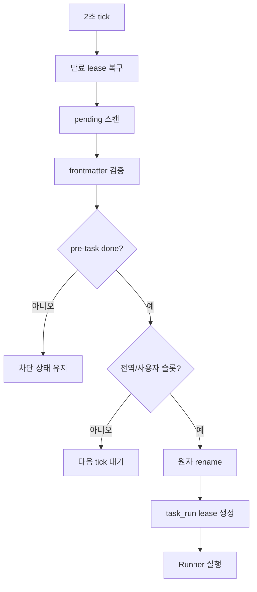
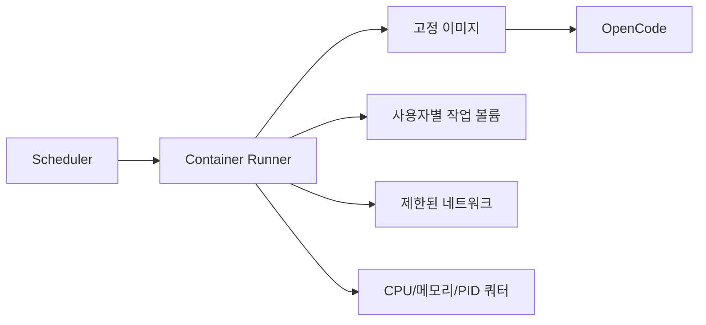
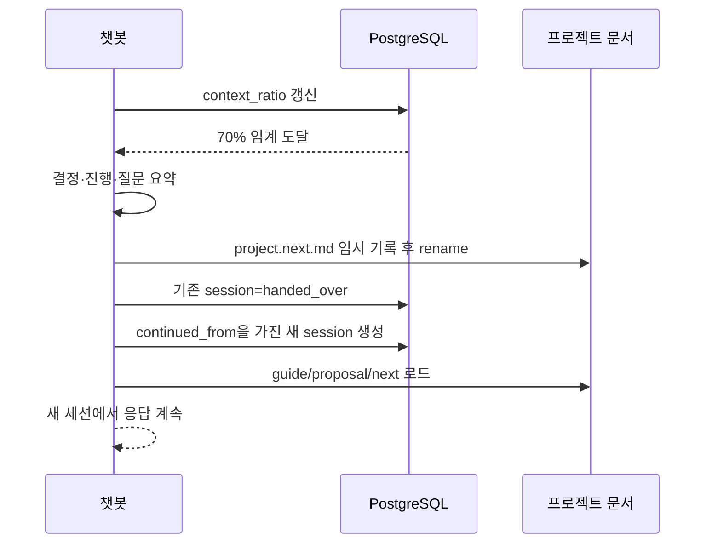

# Dirigo 스케줄러와 워커 설계

## 1. 목적

*Implementation status: partial*

이 문서는 파일 큐를 안전하게 실행하는 스케줄러, OpenCode 러너, 후속 컨테이너 격리와 세션 핸드오버를 정의한다.
전역 기본 동시성은 20이고 작업 기본 제한 시간은 20분이다.

## 2. 구성요소

*Implementation status: partial*

| 구성요소 | 책임 |
|---|---|
| Scanner | pending 파일 발견과 파싱 |
| Dependency Resolver | `pre-task` 완료 확인 |
| Dispatcher | 슬롯과 공정성에 따라 배정 |
| Lease Manager | 중복 실행 방지와 장애 복구 |
| Runner | subprocess 또는 컨테이너 실행 |
| Finalizer | 보고서와 상태 이동 |
| Enqueuer | `next-task` 후속 enqueue |
| Handover Manager | 70% 세션 전환 |

## 3. 스케줄러 루프

*Implementation status: partial*

기본 폴링 주기는 10초이며 `DIRIGO_SCHEDULER_INTERVAL_MS`로 설정한다.
파일 감시 이벤트는 지연 단축용이고 폴링이 정확성의 기준이다.
매 루프는 만료 lease 복구, pending 스캔, 후보 정렬, 슬롯 배정 순서다.



## 4. 후보 선택

*Implementation status: partial*

pending 파일은 생성 시각, 날짜 번호, task ID 순으로 안정 정렬한다.
다중 사용자에서는 사용자별 round-robin으로 한 사용자의 독점을 막는다.
파싱 오류 작업은 실행하지 않고 동기화 오류를 기록한다.
disabled 사용자와 archived 프로젝트의 작업은 픽업하지 않는다.

## 5. 의존성 판정

*Implementation status: implemented*

| `pre-task` 상태 | 처리 |
|---|---|
| null | 실행 가능 |
| done | 실행 가능 |
| pending | 대기 |
| in-progress | 대기 |
| failed | blocked 사유 표시, 자동 실행 금지 |
| 없음 | invalid_dependency 오류 |

자기 참조와 순환은 발주 시 거부하고 스캔 시에도 방어적으로 검사한다.
선행 상태는 파일 위치를 기준으로 하고 DB는 빠른 후보 조회에 사용한다.

## 6. 동시성

*Implementation status: partial*

전역 실행 슬롯은 20개다.
슬롯은 task_run이 running이 될 때 획득하고 종료 정리 뒤 반환한다.
스케줄러는 세션 수준 PostgreSQL advisory lock을 유지하며, 락 보유자만 폴링하고 `leader_pid`를 게시한다.
1차 사용자 한도는 전역 한도와 같고, 2차에는 사용자별 한도를 별도 적용한다.
관리자는 실행 중에도 새 한도를 설정할 수 있으나 기존 작업을 강제 종료하지 않는다.

## 7. 픽업 트랜잭션

*Implementation status: implemented*

1. 후보 파일과 hash를 읽는다.
2. DB 행을 `FOR UPDATE SKIP LOCKED`로 잠근다.
3. 슬롯과 의존성을 다시 확인한다.
4. 파일을 pending에서 in-progress로 원자 rename한다.
5. task status와 새 task_run, lease 만료를 저장한다.
6. 커밋 후 러너에 실행을 전달한다.

rename 뒤 DB 커밋 실패 시 조정기가 in-progress 파일을 발견해 복구한다.
러너 전달 실패 시 run을 failed로 닫고 파일을 failed로 이동한다.

## 8. OpenCode subprocess 계약

*Implementation status: partial*

커맨드 형태는 다음과 같은 배열 인수로 구성하며 shell 문자열 연결을 금지한다.

```text
opencode run --format json --file <task-relative-path>
```

실제 지원 플래그는 구현 시 고정된 OpenCode 버전의 CLI 도움말로 검증한다.
실행 파일 경로와 허용 인수는 관리자 설정의 allowlist에서 선택한다.
작업 디렉터리는 해당 프로젝트의 승인된 checkout 또는 workspace다.
프로젝트 설정의 `workdir`는 프로젝트 루트 기준 상대경로 또는 절대경로다. 따라서 `.`은 프로젝트 루트이고, 값을 지정하지 않으면 `<프로젝트-루트>/workspace`를 사용한다. 상대경로는 프로젝트 루트를 벗어날 수 없다.
실제 경로는 `DIRIGO_DATA_ROOT` 또는 `DIRIGO_WORKDIR_ALLOWLIST`의 콜론 구분 절대 루트 아래여야 한다. 심볼릭 링크 탈출은 작업 실패와 보고서 사유로 기록한다.
작업지시서 경로는 프로젝트 상대 경로로 전달한다.

## 9. 환경변수

*Implementation status: implemented*

| 변수 | 용도 | 비밀 |
|---|---|---|
| `DIRIGO_USER` | 사용자 범위 | 아니오 |
| `DIRIGO_PROJECT` | 프로젝트 범위 | 아니오 |
| `DIRIGO_RUN` | 실행 ID | 아니오 |
| 공급자 키 | LLM 인증 | 예 |

러너는 서버에서 `PATH`, `LANG`, `TZ`만 상속한다. 실행 메타데이터는 직접 구성하고 `HOME` 및 XDG data/config/cache 홈은 불변 사용자 slug 아래의 0700 디렉터리로 지정한다. 서버 provider 키와 API key/token 패턴 변수는 상속하지 않으며, 범위별 LLM 자격 주입은 #009 계획이다.
비밀값은 프로세스 인수, 로그, 보고서에 포함하지 않는다.

## 10. 로그 캡처

*Implementation status: partial*

stdout와 stderr를 분리해 스트리밍 캡처한다.
각 레코드에는 run ID, 순번, 시각, stream을 붙인다.
라인과 전체 로그 크기에 상한을 두고 초과 시 잘림을 표시한다.
토큰, Authorization 헤더, 알려진 비밀 패턴을 마스킹한다.
UI에는 정제된 로그만 노출하고 원본 접근은 관리자로 제한한다.

## 11. 타임아웃과 종료

*Implementation status: implemented*

frontmatter의 `timeout_min`이 없으면 20분을 적용한다.
제한 시간이 되면 정상 종료 신호를 보내고 10초 grace period를 준다.
그 뒤 남은 프로세스 그룹을 강제 종료한다.
timeout run의 상태는 `timed_out`, task 상태는 `failed`다.
종료 코드는 없을 수 있으므로 failure_reason을 필수로 기록한다.

## 12. 완료 판정

*Implementation status: partial*

| 조건 | task 결과 |
|---|---|
| exit code 0 + 유효 보고서 | done |
| exit code 0 + 보고서 없음/오류 | failed |
| exit code non-zero | failed |
| timeout | failed |
| signal 종료 | failed |
| 상태 이동 실패 | finalizing 유지 후 재시도 |

성공이라고 주장하는 출력만으로 done 처리하지 않는다.
보고서 frontmatter와 대응 task 번호를 검증한 뒤 상태를 확정한다.

## 13. Finalizer 순서

*Implementation status: partial*

1. subprocess 종료와 모든 로그 drain을 기다린다.
2. 임시 보고서를 생성하고 fsync한다.
3. 보고서를 reports에 원자 rename한다.
4. 작업지시서를 done 또는 failed로 원자 이동한다.
5. DB task와 task_run을 갱신한다.
6. 슬롯을 반환하고 완료 이벤트를 발행한다.

중간 실패는 재시도 가능한 `finalizing` run 상태로 유지한다.
동일 run 보고서 생성은 멱등적으로 처리한다.

## 14. next-task 자동 enqueue

*Implementation status: partial*

현재 작업이 done일 때만 `next-task`를 평가한다.
후속 파일이 초안 영역 또는 정의된 템플릿으로 존재해야 한다.
후속의 `pre-task`가 현재 파일을 가리키는지 검증한다.
이미 pending 이상 상태면 중복 생성하지 않는다.
조건을 만족하면 pending으로 원자 이동하고 DB에 upsert한다.
실패한 현재 작업은 후속을 자동 enqueue하지 않는다.

## 15. 재시도

*Implementation status: implemented*

자동 재시도 기본값은 0회다.
인프라 일시 오류만 관리 설정 범위에서 지수 backoff 재시도할 수 있다.
코드 실패와 검증 실패는 사용자 재발주를 요구한다.
재시도는 동일 task에 새 attempt와 run ID를 만든다.
이전 로그와 보고서는 덮어쓰지 않고 실행 이력으로 연결한다.

## 16. 장애 복구

*Implementation status: partial*

| 장애 | 복구 |
|---|---|
| 스케줄러 종료 | 새 리더가 만료 lease 스캔 |
| 워커 종료 | task failed 또는 정책상 재시도 |
| DB 단절 | 신규 픽업 중단, 실행 결과 임시 보존 |
| 파일 스토리지 단절 | 실행 시작·finalize 중단 |
| 중복 배정 | rename과 DB lock 중 먼저 실패한 쪽 포기 |

러너 heartbeat는 기본 15초, lease는 기본 60초다.
긴 무출력 작업도 프로세스 생존과 heartbeat를 별도로 확인한다.

## 17. 2차 컨테이너 격리

*Implementation status: planned*



작업마다 비특권 컨테이너를 생성하고 완료 후 제거한다.
루트 파일시스템은 읽기 전용, 작업 볼륨만 쓰기 가능하게 마운트한다.
다른 사용자의 볼륨과 소켓은 마운트하지 않는다.
호스트 컨테이너 런타임 소켓을 작업 컨테이너에 노출하지 않는다.
기본 네트워크는 차단하고 프로젝트 allowlist 목적지만 허용한다.

## 18. 사용자별 자원 한도

*Implementation status: planned*

| 자원 | 기본 정책 |
|---|---|
| 동시 작업 | 사용자당 2, 전역 20 |
| CPU | 작업당 2 vCPU |
| 메모리 | 작업당 4 GiB |
| PID | 작업당 256 |
| 임시 디스크 | 작업당 10 GiB |
| 실행 시간 | 기본 20분, 최대 24시간 |
| 로그 | 실행당 크기 상한 |

값은 초기 권장치이며 관리자가 서비스 용량에 맞게 변경한다.
한도 초과는 명시적 failure_reason과 보고서에 남긴다.

## 19. 이미지와 공급망

*Implementation status: planned*

컨테이너 이미지는 digest로 고정한다.
OpenCode와 런타임 버전을 이미지 메타데이터에 기록한다.
이미지는 취약점 스캔 후 승인 레지스트리에서만 가져온다.
작업 중 패키지 설치는 잠금 파일과 프로젝트 정책을 따른다.

## 20. 세션 컨텍스트 계측

*Implementation status: partial*

매 LLM 호출 후 누적 컨텍스트 토큰과 모델 한도를 갱신한다.
`context_ratio = context_tokens / context_limit`로 계산한다.
비율이 0.70 미만이면 현재 세션을 유지한다.
0.70 이상이며 핸드오버 중이 아니면 단일 핸드오버 작업을 시작한다.
동시 요청은 세션 행 잠금으로 중복 핸드오버를 막는다.

## 21. 핸드오버 흐름

*Implementation status: partial*



사용자에게는 짧은 핸드오버 알림만 표시하고 별도 조작을 요구하지 않는다.
핸드오버 문서는 목표, 결정, 완료, 진행, 장애물, 다음 행동을 포함한다.
대화 원문과 비밀값은 문서에 복제하지 않는다.
쓰기 실패 시 기존 세션을 닫지 않고 다음 호출에서 재시도한다.

## 22. 이메일 완료 알림

*Implementation status: partial*

프로젝트 내 같은 발주 묶음의 terminal 작업 수를 원자적으로 계산한다.
모든 작업이 done 또는 failed이면 결과 요약 이메일을 예약한다.
notification의 idempotency key로 중복 발송을 막는다.
이메일 실패는 작업 상태를 되돌리지 않고 독립 재시도한다.

## 23. 운영 지표

*Implementation status: partial*

- pending 깊이와 가장 오래된 대기 시간
- running 수와 전역·사용자 슬롯 사용률
- 성공, 실패, timeout 비율
- 실행 시간과 큐 대기 시간 분위수
- lease 만료와 중복 픽업 시도 수
- 로그 잘림, 보고서 검증 실패 수
- 핸드오버 성공·실패와 세션당 횟수

## 24. 검증 체크리스트

*Implementation status: partial*

- 전역 running 작업이 20개를 넘지 않는다.
- `pre-task`가 done이 아니면 실행하지 않는다.
- 동일 작업을 두 워커가 동시에 실행하지 않는다.
- 모든 종료 경로에서 보고서가 생성된다.
- timeout은 프로세스 그룹까지 정리하고 failed로 이동한다.
- 성공한 작업만 next-task를 enqueue한다.
- 컨테이너는 다른 사용자 데이터에 접근할 수 없다.
- 70% 핸드오버 후 새 세션이 자동 연결된다.
